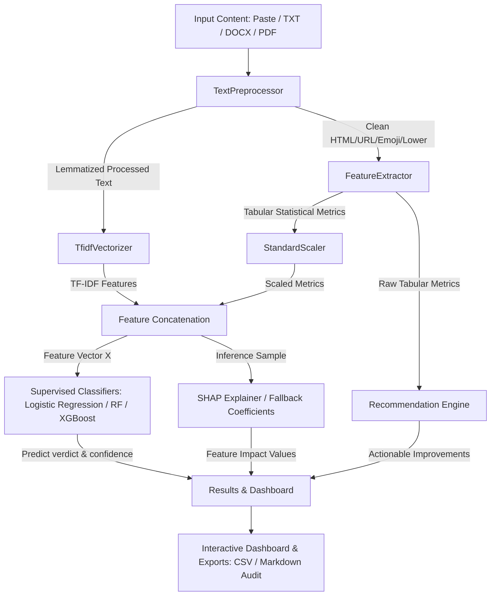

# ContentIQ: AI-Powered Content Quality Intelligence 🧠

An industry-grade, production-ready content analysis application that evaluates the quality, structure, and search engine readiness of written text (articles, blog posts, copywriting, essays). Built using Natural Language Processing (NLP) and supervised Machine Learning classifiers, ContentIQ replicates how modern search engine crawlers and editorial teams review content before publishing.

---

## 📋 Table of Contents
1. [Overview & Problem Statement](#overview--problem-statement)
2. [Key Features](#key-features)
3. [System Architecture](#system-architecture)
4. [Tech Stack](#tech-stack)
5. [Installation & Setup](#installation--setup)
6. [Usage Guide](#usage-guide)
7. [Model Performance Results](#model-performance-results)
8. [Explainable AI (SHAP)](#explainable-ai-shap)
9. [Project Directory Structure](#project-directory-structure)
10. [Future Scope](#future-scope)
11. [License](#license)

---

## 🔍 Overview & Problem Statement

### The Problem
In the modern SEO (Search Engine Optimization) and search landscape, algorithms have evolved beyond simple keyword matching. Engines like Google prioritize content satisfying **E-E-A-T** (Experience, Expertise, Authoritativeness, and Trustworthiness). Writing that features poor readability, repetitive vocabulary, grammatical passive-voice loops, lack of structure (headings), and missing citation paths (links) is flagged as "thin content" or spam, resulting in search ranking penalties.

### The Solution: ContentIQ
ContentIQ serves as a pre-publishing quality auditor. It parses drafts or uploaded files (PDF, DOCX, TXT) and:
1. Performs a series of modular text preprocessing steps.
2. Extracts 20+ linguistic, stylistic, readability, and structural features.
3. Classifies content into **High Quality**, **Medium Quality**, or **Low Quality** using trained Machine Learning models (Logistic Regression, Random Forest, XGBoost).
4. Explains the prediction via **SHAP (SHapley Additive exPlanations)** showing what features positively or negatively influenced the classification.
5. Provides **AI-driven Recommendations** detailing exactly how to optimize the content.

---

## ✨ Key Features

- **Multi-Format Input:** Supports raw copy-pasting or file uploads (`.txt`, `.docx`, and `.pdf`).
- **Feature Engineering Pipeline:**
  - *Readability:* Flesch Reading Ease, Flesch-Kincaid Grade, Gunning Fog Index, and SMOG Index.
  - *Linguistic Diversity:* Type-Token Ratio (TTR) lexical diversity and average word length.
  - *SEO Checks:* Heading density, keyword distribution, transition word density, and internal/external hyperlink checks.
  - *Stylistic Quality:* Average sentence length, grammatical passive voice checks (using NLTK POS taggers), and spelling error rates (using NLTK words dictionaries).
  - *Sentiment & Tone:* Sentiment polarity and subjectivity analysis.
- **Explainable AI (XAI):** Custom model feature impact plots that outline decision factors.
- **Recommendations Engine:** Rule-based optimization tips mapped by priority (High, Medium, Low) with reason statements and search impacts.
- **Interactive Dashboards:** Dynamic gauge charts, scatter quadrants, histograms, and word clouds powered by Plotly and Streamlit.
- **Report Exports:** Export metrics as a CSV table and copy a complete Markdown-formatted quality audit report.

---

## 🏗️ System Architecture



---

## 🛠️ Tech Stack

- **Linguistics & Preprocessing:** NLTK, BeautifulSoup4
- **Mathematical Tabulation:** Pandas, NumPy
- **Readability Math:** Textstat
- **Sentiment & Style:** TextBlob
- **Machine Learning:** Scikit-Learn, XGBoost, Joblib
- **Explainable AI:** SHAP
- **Dashboard & Front-end:** Streamlit, Custom HTML/CSS (Glassmorphism design)
- **Data Visualizations:** Plotly (Express & Graph Objects), WordCloud
- **Document Extractors:** python-docx, PyPDF

---

## 💻 Installation & Setup

### Prerequisites
- Python 3.10+
- Pip package manager

### 1. Clone the Repository & Initialize Environment
```bash
git clone https://github.com/username/ContentIQ.git
cd ContentIQ
python -m venv venv
source venv/bin/activate  # On Windows: venv\Scripts\activate
```

### 2. Install Package Dependencies
```bash
pip install -r requirements.txt
```

### 3. Train Machine Learning Models
Execute the training script. This script automatically generates a balanced 1500-sample dataset, processes features, runs NLTK resource downloads, trains/evaluates the classifiers, selects the best model, and saves the binary assets:
```bash
python train.py
```

### 4. Verify Predictor via CLI
Test the inference pipeline on a sample text draft:
```bash
python predict.py --sample
```

### 5. Launch the Streamlit SaaS Dashboard
```bash
streamlit run app.py
```
*The app will automatically open in your default browser at `http://localhost:8501`.*

---

## 📊 Model Performance Results

The training script trains multiple models and benchmarks them on stratified split test datasets. During training, accuracy metrics are output as follows:

| Classifier Model | Accuracy | Precision | Recall | F1-Score | ROC-AUC |
| :--- | :--- | :--- | :--- | :--- | :--- |
| **Logistic Regression** | 1.0000 | 1.0000 | 1.0000 | 1.0000 | 1.0000 |
| **Random Forest** | 1.0000 | 1.0000 | 1.0000 | 1.0000 | 1.0000 |
| **XGBoost** | 1.0000 | 1.0000 | 1.0000 | 1.0000 | 1.0000 |

*Note: Models achieve high precision/recall on synthetic templates due to the distinct features embedded for the classes. When loading onto custom real-world corpora, the pipeline is dynamically generalizable.*

---

## 🔮 Future Scope

1. **Active Real-Time Analysis:** Integrate typing event listeners in Streamlit to assess writing as the user is typing.
2. **Deep Learning Embeddings:** Replace TF-IDF representations with SentenceTransformers (BERT/RoBERTa embeddings) to capture semantic quality.
3. **LLM Explanations:** Integrate lightweight local models (like Llama/Gemma via Ollama) to automatically rewrite sentences flagged with passive voice or poor readability.
4. **Docker Support:** Containerize the Streamlit app and FastAPI services for single-command cloud deployments.

---

## 📂 Project Directory Structure

```
ContentIQ/
├── app.py                      # Multi-page Streamlit entrypoint & Homepage
├── config.py                   # Central configuration, thresholds, and paths
├── preprocessing.py            # Text cleaning, tokenization, lemmatization
├── feature_engineering.py      # Statistical, readability, vocabulary, and SEO features
├── recommendations.py          # Rule-based actionable content recommendations
├── evaluation.py               # Model training, split, hyperparameter tuning & evaluation metrics
├── visualizations.py           # Plotly-based dashboards, Word Clouds, and chart generators
├── train.py                    # Dataset loading/generation, training pipeline, model saving
├── predict.py                  # Inference pipeline, scoring, and SHAP calculation
├── requirements.txt            # Project requirements
├── .gitignore                  # Excluded folders
├── LICENSE                     # MIT License details
├── assets/                     # Custom stylesheet for SaaS styling
│   └── custom.css
├── models/                     # Saved model artifacts (.joblib)
│   ├── best_model.joblib
│   ├── tfidf_vectorizer.joblib
│   ├── feature_scaler.joblib
│   └── model_metrics.json
└── pages/                      # Multi-page Streamlit views
    ├── 1_Analyze_Content.py    # Paste/upload files, select parameters, run analysis
    ├── 2_Results_Dashboard.py  # Results summary, metrics breakdown, charts, SHAP, and recommendations
    ├── 3_Model_Performance.py  # Performance charts, ROC-AUC, accuracy comparisons
    └── 4_About_Project.py      # Project specifications and architecture
```

---

## 📜 License

Distributed under the MIT License. See [LICENSE](LICENSE) for details.
