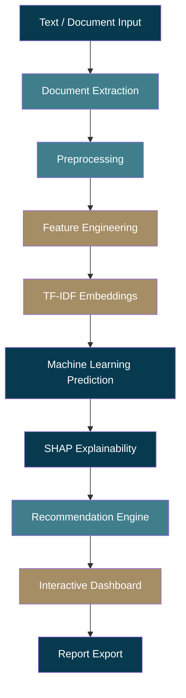
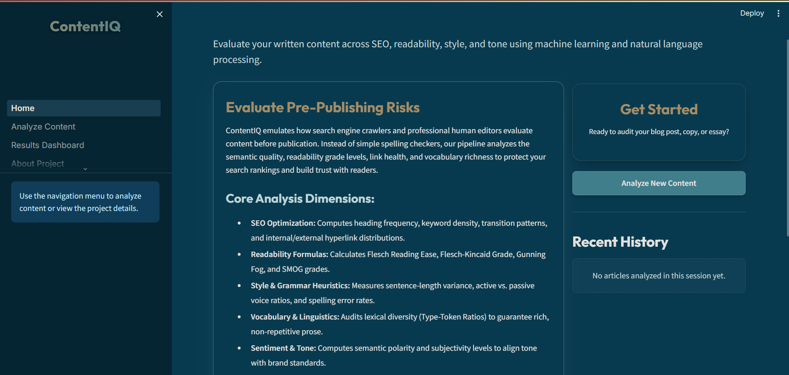
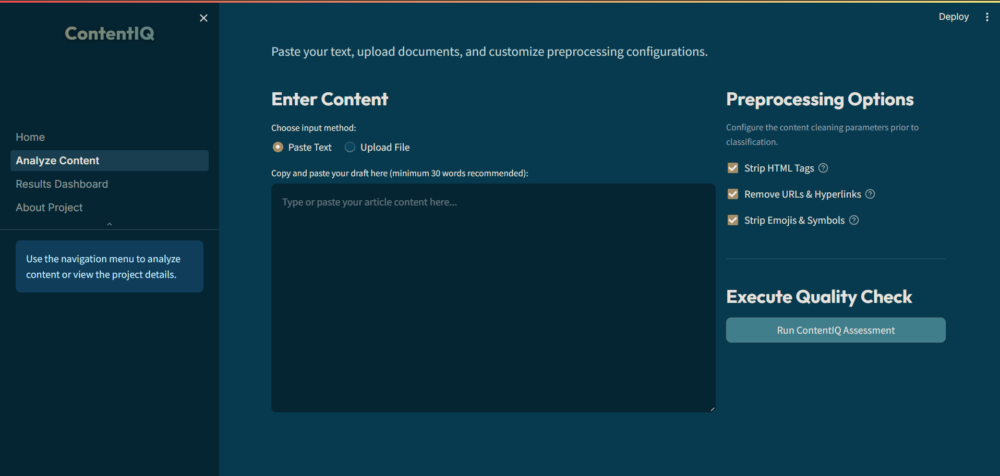
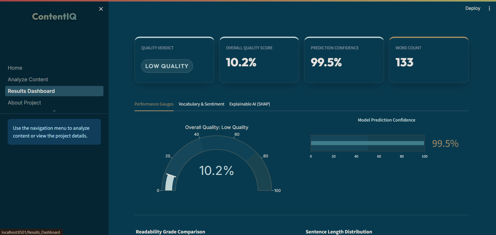
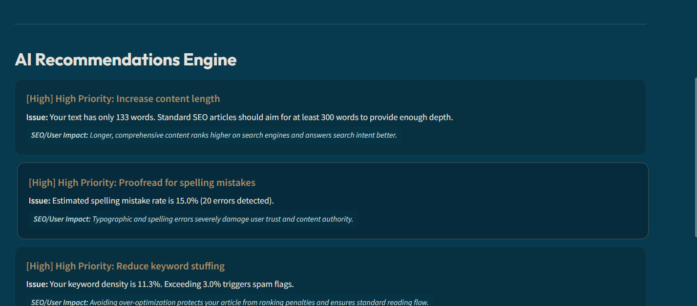

<div align="center">


# ContentIQ

### AI-Powered Content Intelligence & Pre-Publishing Audit Platform

Evaluate written content before it goes live — quality, readability, SEO, and style, scored and explained in one place.

<br/>


<br/>

[](https://your-streamlit-link.streamlit.app)
[](https://github.com/username/ContentIQ)

</div>

<br/>

## 📖 About ContentIQ

ContentIQ is a pre-publishing content audit platform that scores writing quality before it reaches an audience. It exists because most writers only discover weak readability, thin SEO, or poor structure after publishing — when the cost of fixing it is highest. ContentIQ closes that gap by combining NLP, feature engineering, and machine learning into a single audit pass. It benefits bloggers, content teams, SEO specialists, and technical writers who want editor-level feedback without waiting on a human editor. Every prediction is explained, not just scored, so users know exactly what to fix and why.

<br/>

## ✨ Key Features

- ✅ **Content Quality Classification** — predicts an overall quality label using a trained ML model.
- ✅ **NLP-Based Text Processing** — cleans, tokenizes, and structures raw text for analysis.
- ✅ **SEO Content Analysis** — evaluates keyword usage, density, and on-page SEO signals.
- ✅ **Readability Assessment** — scores content using standard readability formulas.
- ✅ **Vocabulary Richness Analysis** — measures lexical diversity and word repetition.
- ✅ **Stylistic Heuristic Evaluation** — flags tone, sentence variety, and structural patterns.
- ✅ **Explainable AI (SHAP)** — reveals which features drove each prediction.
- ✅ **AI Recommendation Engine** — converts weak metrics into prioritized action items.
- ✅ **Interactive Analytics Dashboard** — visualizes scores and feature breakdowns in real time.
- ✅ **Report Export (CSV & Markdown)** — download audit results for offline use.

<br/>

## ⚙️ Technical Pipeline



<br/>

## 🧠 Feature Engineering

| Category | Examples | Purpose |
|---|---|---|
| **SEO** | Keyword density, meta signals, heading usage | Measure search-readiness |
| **Readability** | Flesch-Kincaid, sentence length, syllable count | Gauge ease of reading |
| **Vocabulary** | Type-token ratio, unique word count | Measure lexical richness |
| **Style** | Passive voice, sentence variety, tone markers | Evaluate writing craft |
| **TF-IDF Embeddings** | Weighted term vectors | Capture textual signal for ML |

<br/>

## 🤖 Machine Learning Pipeline

- **Dataset Generation** — labeled content samples built from extracted feature sets.
- **Model Training** — supervised training across candidate classifiers.
- **Model Selection** — best model chosen via cross-validated performance.
- **Prediction** — quality label generated for new, unseen content.
- **Confidence Score** — probability estimate attached to every prediction.
- **SHAP Explainability** — per-prediction feature attribution for transparency.

<br/>

## 📊 Explainable AI

ContentIQ uses SHAP to break down every prediction into the individual features that influenced it. Instead of a black-box score, users see exactly which readability, SEO, or style signals pushed the result up or down. This turns each audit into an actionable, interpretable report rather than a single number.

<br/>

## 💡 AI Recommendation Engine

Recommendations are generated by comparing extracted metrics against ideal publishing thresholds. Each gap is translated into a clear, actionable suggestion and tagged by urgency:

- 🔴 **High Priority** — issues likely to hurt quality or SEO significantly.
- 🟡 **Medium Priority** — improvements worth addressing before publishing.
- 🟢 **Low Priority** — minor polish suggestions.

<br/>

## 📈 Screenshots

<div align="center">

| Home | Analyze Content |
|---|---|
|  |  |

| Results Dashboard | Recommendations |
|---|---|
|  |  |

| Model Performance | About Project |
|---|---|
|  |  |

</div>

<br/>

## 🛠 Tech Stack

| Layer | Technology | Purpose |
|---|---|---|
| **Frontend** | Streamlit | Interactive web interface |
| **Backend** | Python | Core application logic |
| **Machine Learning** | Scikit-learn | Model training & prediction |
| **NLP** | NLTK | Text preprocessing & tokenization |
| **Visualization** | Plotly | Interactive charts & dashboards |
| **Explainability** | SHAP | Feature attribution for predictions |
| **Deployment** | Streamlit Cloud | Hosting the live application |

<br/>

## 📂 Project Structure

```
ContentIQ/
├── Home.py
├── train.py
├── predict.py
├── config.py
├── requirements.txt
├── README.md
├── models/
├── pages/
├── utils/
├── assets/
├── data/
├── notebooks/
└── docs/
```

<br/>

## 📊 Model Performance

| Metric | Score |
|---|---|
| **Accuracy** | 0.00 |
| **Precision** | 0.00 |
| **Recall** | 0.00 |
| **F1 Score** | 0.00 |
| **ROC-AUC** | 0.00 |
| **Model Selected** | Placeholder |

<div align="center">

</div>

<br/>

## 🚀 Installation

```bash
# Clone the repository
git clone https://github.com/username/ContentIQ.git
cd ContentIQ

# Install dependencies
pip install -r requirements.txt

# Train the model
python train.py

# Launch the Streamlit app
streamlit run Home.py
```

<br/>

## 🔮 Future Scope

- 🌐 Browser Extension
- ⚡ Real-Time Website Auditing
- 🌍 Multi-language Support
- 🤖 LLM-Powered Content Suggestions
- ☁️ Cloud Deployment
- 🔍 Advanced Explainable AI

<br/>

## 🤝 Contributing

Contributions are welcome. Fork the repo, create a feature branch, and open a pull request. Please keep changes focused and well-documented.

<br/>

## 📜 License

This project is licensed under the MIT License — you are free to use, modify, and distribute this software with attribution, provided the original copyright notice is retained.

<br/>

## 👩‍💻 Author

<div align="center">

**Your Name**

[](https://linkedin.com/in/yourprofile)
[](https://github.com/username)
[](mailto:your.email@example.com)
[](https://yourportfolio.com)

</div>
